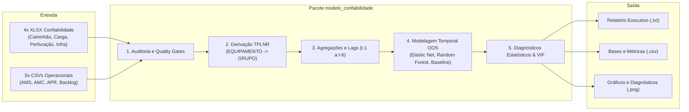

# Documentação do Modelo de Previsão de Confiabilidade (`modelo_confiabilidade`)

Bem-vindo à documentação técnica oficial do pacote **`modelo_confiabilidade`**, desenvolvido para modelagem preditiva, auditoria de dados e diagnóstico estatístico dos indicadores mensais de confiabilidade de frotas industriais e de mineração.

---

## 1. Visão Geral do Sistema

O objetivo do sistema é **prever os indicadores de confiabilidade do próximo mês ($t+1$)** por grupo de equipamentos com base nos dados operacionais de manutenção observados no mês atual ($t$) e em seu histórico recente ($t-1 \dots t-6$).



---

## 2. Indicadores de Confiabilidade Modelados

O modelo prevê cinco variáveis-alvo fundamentais para o planejamento de manutenção:
* **`DF (REAL)`**: Disponibilidade Física Real.
* **`MTBF (REAL)`**: Tempo Médio Entre Falhas (*Mean Time Between Failures*).
* **`MTBS (REAL)`**: Tempo Médio Entre Paradas (*Mean Time Between Stops*).
* **`MTTR`**: Tempo Médio Para Reparo (*Mean Time To Repair*).
* **`NIC (VMINA)`**: Número de Intervenções Corretivas.

---

## 3. Guia Rápido de Execução

O pacote é executado via linha de comando no ambiente Python:

```bash
# Execução padrão
python -m modelo_confiabilidade \
  --input-dir ./bases \
  --output-dir ./resultados \
  --test-months 3 \
  --max-lag 6
```

Para ver todos os parâmetros e opções disponíveis:
```bash
python -m modelo_confiabilidade --help
```

---

## 4. Estrutura da Documentação

A documentação está dividida nos seguintes tópicos especializados:

1. **[Fontes de Indicadores de Confiabilidade](indicadores.md)**: Detalhamento das quatro pastas de trabalho XLSX, universos atendidos, abas `Export` e variáveis de resposta.
2. **[Fontes Operacionais de Manutenção](operacionais.md)**: Características dos cinco CSVs brutos do SAP (AMS Contador, AMS Calendário, AMC, APR e Backlog) e estratégias de agregação.
3. **[Pipeline de Previsão Temporal e Modelagem](pipeline_modelagem.md)**: Fluxo de dados, derivação de grupos por `TPLNR`, engenharia de lags ($t-1$ a $t-6$), proteção anti-vazamento e algoritmos de ML.
4. **[Diagnósticos Estatísticos e Validação](diagnosticos_e_validacao.md)**: Critérios de validação fora da amostra (OOS), testes de resíduos, VIF, importância por permutação e classificação (`VALIDO`, `EXPLORATORIO`, `INVALIDO`).
5. **[Guia de Execução CLI e Catálogo de Saídas](cli_e_resultados.md)**: Referência de todas as flags da CLI, modos de execução (completo vs audit-only) e dicionário de todos os arquivos gerados.
6. **[Dicionário de Dados e Metadados](dicionario.md)**: Nomenclatura das features geradas, convenções de status semântico e chaves de relacionamento.
7. **[Evolução Arquitetural e Contexto](evolucao_e_contexto.md)**: Registro histórico da transição de um estudo exploratório inicial em notebook para uma arquitetura robusta de aprendizado de máquina.

---

## 5. Estrutura do Pacote de Código

```text
modelo_confiabilidade/
├── __init__.py           # Identificador do pacote
├── __main__.py           # Ponto de entrada CLI e orquestração do pipeline
├── configuracao.py       # Contrato de configuração (Config, parse_args, logs)
├── dados.py              # Leitura, normalização, hierarquia TPLNR, lags e features
├── auditoria.py          # Quality gates, auditoria estrutural e de coerção
├── modelagem.py          # Pipelines Elastic Net/Random Forest, baseline e validação temporal
├── diagnosticos.py       # VIF, testes de resíduos, importância OOS e classificação
└── relatorios.py         # Persistência CSV, gráficos PNG e relatório executivo TXT
```
