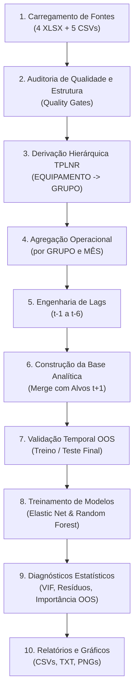

# Pipeline de Previsão Temporal e Modelagem

Este documento descreve o fluxo de processamento, engenharia de features, divisão temporal e algoritmos de aprendizado de máquina implementados no pacote `modelo_confiabilidade`.

---

## 1. Visão Geral do Fluxo

O pipeline opera em etapas estritamente sequenciais e auditáveis para prever os indicadores de confiabilidade do próximo mês ($t+1$) a partir dos dados operacionais e de manutenção observados até o mês de referência ($t$).



---

## 2. Derivação Hierárquica e Agrupamento (`TPLNR`)

Nas bases operacionais SAP, os equipamentos e grupos de manutenção são identificados estruturalmente no campo `TPLNR` (Local de Instalação).

### Regra de Extração
Para cada registro operacional com `TPLNR`, os dois últimos segmentos delimitados por hífen (`-`) definem o agrupamento:
* **`GRUPO`**: Penúltimo segmento (`TPLNR.str.split("-")[-2]`).
* **`EQUIPAMENTO`**: Último segmento (`TPLNR.str.split("-")[-1]`).

### Validação de Consistência
Antes do agrupamento, o módulo [`dados.py`](file:///home/marcus/projects/vale/trigger/modelo_confiabilidade/dados.py) valida:
1. **Completude:** `TPLNR` não nulo, não vazio e com no mínimo 2 segmentos válidos.
2. **Unicidade:** Nenhum equipamento pode estar associado a mais de um grupo no mesmo universo.
3. **Cobertura:** Todos os equipamentos presentes nas bases de indicadores de confiabilidade devem ter correspondência na hierarquia operacional. Caso haja equipamentos sem grupo, a execução é interrompida com diagnóstico acionável.

*Nota:* O parâmetro `--group-map-file` está disponível como *override* opcional para casos em que um mapeamento manual em CSV deva sobrescrever a regra padrão do `TPLNR`.

---

## 3. Agregação Operacional e Defasagens Temporais (Lags)

### Agregação Mensal
Cada fonte operacional (AMS Contador, AMS Calendário, AMC, APR e Backlog) é tratada e agregada separadamente em nível de `GRUPO` e `MES` antes dos cruzamentos:
* Métricas numéricas brutas (`IMAINDI*`, contadores, horas de backlog, notificações) geram agregações mensais (como soma e média).
* As transformações e fontes de origem são registradas na tabela de metadados de features (`mapeamento_features`).

### Engenharia de Lags e Proteção Anti-Vazamento (*Anti-Leakage*)
Para prever a resposta no mês $t+1$:
1. Apenas features observadas em $t$ ou anteriores ($t-1, t-2, \dots, t-\text{max\_lag}$) são disponibilizadas para o modelo.
2. Defasagens históricas são calculadas por grupo ao longo da série temporal usando [`create_lag_features`](file:///home/marcus/projects/vale/trigger/modelo_confiabilidade/dados.py#L720-L750).
3. Respostas futuras, campos de status posteriores ou variáveis de resultado de períodos contemporâneos ao alvo são explicitamente filtrados e excluídos dos preditores.
4. Features com alta taxa de valores nulos no treino (superior a `1 - min_feature_non_null`) são descartadas preventivamente.

---

## 4. Divisão Temporal Fora da Amostra (Out-of-Sample Split)

O pipeline implementa uma separação temporal rígida para evitar vazamento entre passado e futuro:

* **Conjunto de Teste Final (OOS):** Formado pelos últimos $N$ meses da série histórica (configurado via `--test-months`, default `3`).
* **Conjunto de Treino:** Formado pelos meses anteriores ao período de teste.
* **Validação Cruzada Temporal:** Expansão progressiva de janelas temporais (*expanding/rolling window*) para estimar a variância e estabilidade das métricas entre dobras.

```text
Série Temporal: |---------------- Treino ----------------|--- Teste OOS (3 meses) ---|
                                                          ^ Previsão do futuro próximo
```

---

## 5. Modelos Estimadores

Para cada um dos cinco indicadores de confiabilidade (`DFREAL`, `MTBFREAL`, `MTBSREAL`, `MTTR`, `NICVMINA`), o pipeline ajusta e compara:

### 1. Baseline de Persistência (Benchmark)
* **Definição:** Previsão ingênua onde o valor previsto para $t+1$ é simplesmente o valor observado no mês $t$:
  $$\hat{y}_{t+1} = y_t$$
* **Finalidade:** Serve como régua mínima obrigatória. Qualquer modelo de aprendizado de máquina supervisionado precisa superar o baseline de persistência para ser considerado válido.

### 2. Elastic Net (`SGDRegressor` / `ElasticNet`)
* **Abordagem:** Regressão linear regularizada combinando penalidades L1 (Lasso) e L2 (Ridge).
* **Vantagens:** Seleciona subconjuntos esparsos de variáveis operacionais relevantes, lida com colinearidade residual e produz coeficientes lineares interpretáveis.

### 3. Random Forest Regressor
* **Abordagem:** Conjunto de árvores de decisão não lineares com amostragem aleatória de features.
* **Vantagens:** Captura interações não lineares complexas entre indicadores de manutenção e operação sem impor pressupostos de linearidade.

---

## 6. Métricas de Avaliação

A performance de cada modelo é calculada tanto no treino quanto no teste OOS:
* **MAE (Mean Absolute Error):** Erro médio em magnitude absoluta na unidade original do indicador.
* **RMSE (Root Mean Squared Error):** Raiz do erro quadrático médio (penaliza erros de maior magnitude).
* **MAPE (Mean Absolute Percentage Error):** Erro percentual relativo médio.
* **$R^2$ (Coeficiente de Determinação):** Proporção da variância do indicador explicada pelas features operacionais.
* **Melhoria sobre o Baseline:** Ganho percentual no MAE em comparação ao baseline ingênuo:
  $$\text{Melhoria} = \frac{\text{MAE}_{\text{baseline}} - \text{MAE}_{\text{modelo}}}{\text{MAE}_{\text{baseline}}}$$
